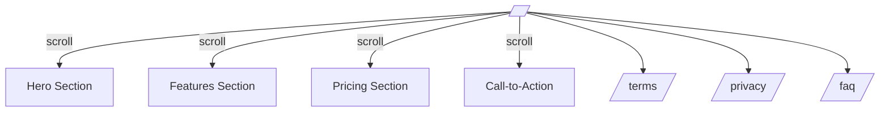
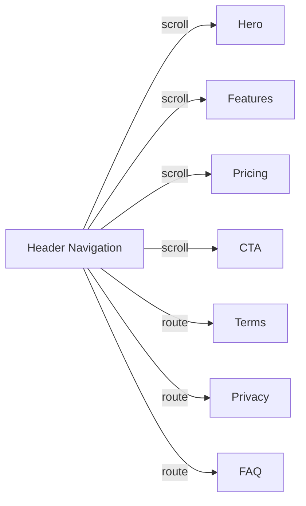
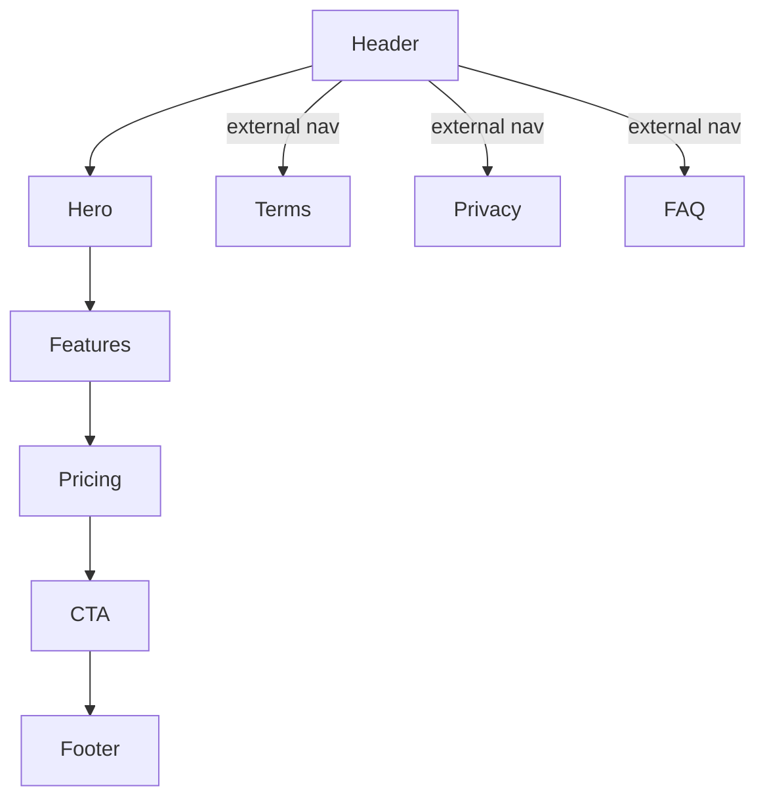

# KriviLak AI Landing Page & Multi-Page Site: UI & Architecture Specification

Last updated: 2025-06-28

---

## 1. Overview

KriviLak AI aims to unify chat access across providers (ChatGPT, Gemini, Meta, etc.), streamlining multi-provider AI chat and future automation features into a single app. This spec covers the **public-facing site**: a structured, scalable, conversion-focused landing page plus legal/docs routes, designed with production-level quality and maintainability in mind.

---

## 2. Site Map & Page Structure



- `/` – **Main landing**. Includes sections:
  - Hero (tagline, CTA)
  - Features (multi-provider, automation, simplicity, etc.)
  - Pricing (table: Starter, Pro, Pro Plus)
  - CTA (convert/join/sign up)
- `/terms` – **Terms and Conditions** (header/footer reused)
- `/privacy` – **Privacy Policy** (header/footer reused)
- `/faq` – **FAQ or Contact** (header/footer reused)

*Future expansion possible, e.g. testimonials, partners, integrations, blog, contact.*

---

## 3. Navigation & User Experience

### Navigation Model

- **Header**: Logo + nav links.
  - Links for Hero, Features, Pricing, CTA use `#section-id` scroll (single-page SPA experience).
  - Legal/docs links use normal Remix routing (`/terms`, `/privacy`, `/faq`).
- **Responsive**: Collapsible navigation on mobile, accessible skip links for a11y.
- **Sticky**: Header remains visible on scroll.



### Footer

- Compact, includes:
  - Logo, copyright
  - Quick links (`/terms`, `/privacy`, `/faq`)
  - Socials (icons for Github, Twitter, Discord, optional)

---

## 4. Component & Folder Structure

```
app/
  components/
    layout/
      Header.tsx        # Navbar/appbar, handles internal/external navigation
      Footer.tsx
    landing/
      Hero.tsx
      Features.tsx
      Pricing.tsx
      CTA.tsx
    shared/
      Section.tsx       # Reusable section container for spacing/anchors
  routes/
    _index.tsx          # Landing page, composed of sections, anchors for SPA scroll
    terms.tsx           # Legal route, full page (Header/Footer used)
    privacy.tsx
    faq.tsx
  tailwind.css
  root.tsx              # Layout for app (includes Header/Footer wrapper)
```

---

## 5. Section-by-Section Breakdown

#### Hero

- **Logo** (light/dark), big headline, minimal copy
- Tagline e.g.: "Simplifying AI Chat. One App, All Providers."
- Primary CTA Button: "Get Started", scrolls to CTA section
- Secondary Button: "See Plans", scrolls to pricing
- Supporting graphic or illustration (optionally use assets/logos)

#### Features

- List of main value props:
  - Multi-provider (ChatGPT, Gemini, Meta, etc.) unified chat
  - Simple, single interface
  - Task automation (future-ready)
  - Secure & private
  - Fast setup, modern design
- Use icon + brief text for each feature

#### Pricing

- Three plans as cards/table rows:
  - **Starter** (Free)
  - **Pro** ($10/mo)
  - **Pro Plus** ($30/mo)
- Each card has rows for features/benefits (flexible, you can update copy later)
- Highlight best value (optional badge)
- Clear CTA for each (e.g., "Join Free", "Get Pro")

#### Call to Action (CTA)

- Final conversion area w/ button(s) for signup or waitlist
- Optionally includes short testimonial or stat

#### Footer

- Logos, site links, socials

#### Legal/Other Pages

- `/terms`, `/privacy`, `/faq`: Full-width, readable, minimal
- Header/Footer reused, main content via Markdown or JSX for legal docs

---

## 6. UI/UX Principles

- **No hardcoded colors or pixel values**: use Tailwind for all colors, spacing, fonts.
- **Dark/Light mode**: Follow Tailwind/theming best practice
- **Production quality**: Leverage shadcn/ui for accessible, consistent design language and polish
- **Responsive**: All layouts and text scale gracefully to mobile/tablet/desktop
- **Accessibility**: Passes basic a11y checks (semantic HTML, color contrast, focus states, alt text, ARIA roles)

---

## 7. Implementation Steps

1. **Scaffold** folder/component structure as above
2. Build `Header` and `Footer` (make navigation sticky, responsive)
3. Compose landing `/` by assembling: `Hero`, `Features`, `Pricing`, `CTA`
4. Implement full-page routes for `/terms`, `/privacy`, `/faq`
5. Wire up all navigation links/anchors for seamless SPA-like scrolling
6. Add dummy content in pricing rows (for later updates)
7. Test in all viewports/dark light
8. Polish with shadcn/ui primitives/patterns
9. Refine based on stakeholder review

---

## 8. Update Instructions

- **Editing Pricing Benefits**: Just update the benefit rows in the Pricing component or Table. The cards/rows are built for easy content changes.
- **Adding Sections**: Add to `/app/components/landing/`, import/order as needed in `_index.tsx`.
- **Legal Content**: Update the JSX/MDX in `/app/routes/terms.tsx`, `/app/routes/privacy.tsx`, etc.
- **Logos**: Swap out `/public/logo-dark.png` and `/public/logo-light.png`, update `<Header />` and `<Footer />` as needed.

---

## 9. Sample Component Import Layout (Landing Page)

```tsx
// /app/routes/_index.tsx

import { Header } from '~/components/layout/Header'
import { Hero } from '~/components/landing/Hero'
import { Features } from '~/components/landing/Features'
import { Pricing } from '~/components/landing/Pricing'
import { CTA } from '~/components/landing/CTA'
import { Footer } from '~/components/layout/Footer'

export default function Index() {
  return (
    <>
      <Header />
      <main>
        <Hero />
        <Features />
        <Pricing />
        <CTA />
      </main>
      <Footer />
    </>
  )
}
```
---

## 10. Mermaid: Section Order and Routing



---

## 11. References & Inspiration

- [shadcn/ui production patterns](https://ui.shadcn.com/)
- [Remix Docs](https://remix.run/docs/en/main)
- [Tailwind Best Practices](https://tailwindcss.com/docs)
- [Stripe.com Landing (as industry reference)](https://stripe.com/)
- [Vercel.com Landing (industry reference)](https://vercel.com/)

---
